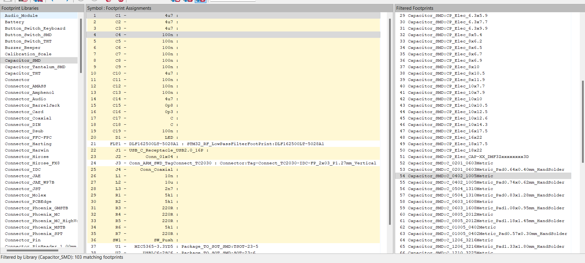

### Schematic Design 

Chip used :- STM32WB55CEU6.

Important Online Note :-
<https://www.st.com/resource/en/application_note/an5165-how-to-develop-rf-hardware-using-stm32wb-microcontrollers-stmicroelectronics.pdf>

This is the reference :-

Use STM32CubeIDE to get more information about the Chip :-

Here I have enabled I2C on PB8 and PB9
corresponding to Pin 5 and 6 respectively.

In Kicad, import the board STM32WB55CEUX.

Ground the Pins VSS5MP5, VSSRF and VSS.

As illustrated on the reference manual, the Pin VDDUSB, VDDA, VDD, VDD,
VDD and VBAT are connected to 3.3V power supply through bigger capacitor
(4.67uF) and smaller capacitors (100nF : local supply).

For VDDRF, connect it to 100nF capacitor along with power supply

We need Stepdown converter to step down voltage for lower voltage. For 8
MHz we use 2.2uH inductor and for 4MHz we use 10uF inductor. SMPSLX --
Switch Mode Power Supply

SMPSFB -- Switch Power Supply Feed Back

The low frequency oscillator(Crystal) is connected to Pin 2 and 3.

The high frequency
oscillator(Crystal_GND24) are connected to Pin 24 and 25.

We can add resistor in HSC_IN to increase the longevity of oscillator.

RF Section:-

We need low pass filter for 2.4GHz and 5GHz.

For that we need to create a footprint and symbol of DLF162500LT-5028A1.

From File, Add library\> DLF162500LT-5028A1

Go to the Pin table and add pins.

Use the rectangle tool on the right side to draw the rectangle touching
the pins.

Use the Text "T" tool to add the text label "2.4GHz- 2.5GHz".

Save the symbol. Now it's time to create the physical footprint of the
symbol.

Use this footprint editor to create the new footprint.

Go to file \> Add library and name your library.

Here the newly added library is STM32_RF_LowPassFilterFootPrint

In the new library, add new Footprint and name it as Component name eg.
"DLF162500LT-5028A1"

This is the dimension of
[footprint](https://product.tdk.com/system/files/dam/doc/product/rf/rf/filter/catalog/rf_lpf_dlf162500lt-5028a1_en.pdf).

Add pad from here.

According to the dimension, the centre of origin:-

X : ½ ( 0.275 + 0.45) + 0.25 = 0.6125.

Y : ½ (0.245 +0.21) = 0.2275

This is the position and dimensions of pad1 :-

This is the position and dimensions of pad 3:-

This is the position and dimensions of pad 2:-

This is the position and dimensions of pad 4:-

Download 3D Model of symbol from ultralibrarian in .step format.

In Kicad go to footprint properties and
add the 3d model. Our pad aligns with physical pins.

With silkscreen layer selected, click
circle tool to add indicator for pin 1.

Using the symbol editor, assign newly created footprint to the symbol we
just created.

Place newly created symbol to the schematic and connect to pin 1.

Add a Co-Axial connector.

This is our current progress.

Now, we need to add the programming interface.

The PA 13, PA 14 and PA3 can be used to program and debug the board.
Along with those pins NRST has to be low (0) for programming mode and
high (1) on normal mode.

Connect the tag connector "Conn_ARM_SWD_TagConnect_TC2030". Connect the
tag connector to respective pin as shown. For NRST( Reset) pin connect
it through 100nF capacitor at Pin 7.

PH3 is bootload pin and should 0 be on bootload. When the pin Switch is
not pressed, the PH3 is grounded but on pressed, the connection acts as
lowpass RC filter.

Add USB "USB_C_Receptacle_USB2.0_16P" and we are going to use pin 37 and
38.

Add a USB protector between the USB Connector and Pins.

The D- pins and D+ pins are connected each other and then to Pins 1 and
3 respectively on the USB protector. The VBUS is connected to Pin 5. Pin
6 and 4 are connected to Pin 37 and 37 respectively on the STM32
Microcontroller.

The pull down resistors are tied on the Pin A5 and B5.

Convert 5V of VBUS to 3.3V using LDO voltage regulator.

Search LDO voltage regulator by putting requirement on mouser. Add a
voltage regulator "MIC5365-3.3YD5" to get 3.3V output.

Add a Peripheral connection on PA2 and PA2
using Generic 01\*04 Connector.

Use PA7 for PWM Output signal generation.

Add LED to Pin 16 (PA7) and add current limiting 220 Ohm resistor.

Overall schematic :-

Run electric rule checker and make sure all
wirings are correct.

Add footprint to the capacitor.

Add footprint to all the components.

Create Bill of Materials for all the components.

Add netclass to group the components.

