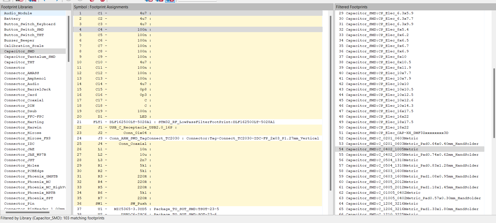
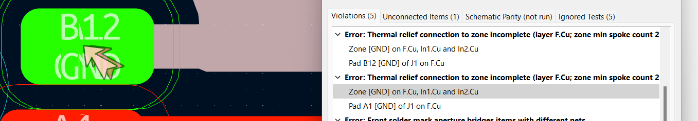

Chip used :- STM32WB55CEU6.

Important Online Note :-
<https://www.st.com/resource/en/application_note/an5165-how-to-develop-rf-hardware-using-stm32wb-microcontrollers-stmicroelectronics.pdf>

This is the reference :-

Use STM32CubeIDE to get more information about the Chip :-

Here I have enabled I2C on PB8 and PB9
corresponding to Pin 5 and 6 respectively.

In Kicad, import the board STM32WB55CEUX.

Ground the Pins VSS5MP5, VSSRF and VSS.

As illustrated on the reference manual, the Pin VDDUSB, VDDA, VDD, VDD,
VDD and VBAT are connected to 3.3V power supply through bigger capacitor
(4.67uF) and smaller capacitors (100nF : local supply).

For VDDRF, connect it to 100nF capacitor along with power supply

We need Stepdown converter to step down voltage for lower voltage. For 8
MHz we use 2.2uH inductor and for 4MHz we use 10uF inductor. SMPSLX --
Switch Mode Power Supply

SMPSFB -- Switch Power Supply Feed Back

The low frequency oscillator(Crystal) is connected to Pin 2 and 3.

The high frequency
oscillator(Crystal_GND24) are connected to Pin 24 and 25.

We can add resistor in HSC_IN to increase the longevity of oscillator.

RF Section:-

We need low pass filter for 2.4GHz and 5GHz.

For that we need to create a footprint and symbol of DLF162500LT-5028A1.

From File, Add library\> DLF162500LT-5028A1

Go to the Pin table and add pins.

Use the rectangle tool on the right side to draw the rectangle touching
the pins.

Use the Text "T" tool to add the text label "2.4GHz- 2.5GHz".

Save the symbol. Now it's time to create the physical footprint of the
symbol.

Use this footprint editor to create the new footprint.

Go to file \> Add library and name your library.

Here the newly added library is STM32_RF_LowPassFilterFootPrint

In the new library, add new Footprint and name it as Component name eg.
"DLF162500LT-5028A1"

This is the dimension of
[footprint](https://product.tdk.com/system/files/dam/doc/product/rf/rf/filter/catalog/rf_lpf_dlf162500lt-5028a1_en.pdf).

Add pad from here.

According to the dimension, the centre of origin:-

X : ½ ( 0.275 + 0.45) + 0.25 = 0.6125.

Y : ½ (0.245 +0.21) = 0.2275

This is the position and dimensions of pad1 :-

This is the position and dimensions of pad 3:-

This is the position and dimensions of pad 2:-

This is the position and dimensions of pad 4:-

Download 3D Model of symbol from ultralibrarian in .step format.

In Kicad go to footprint properties and
add the 3d model. Our pad aligns with physical pins.

With silkscreen layer selected, click
circle tool to add indicator for pin 1.

Using the symbol editor, assign newly created footprint to the symbol we
just created.

Place newly created symbol to the schematic and connect to pin 1.

Add a Co-Axial connector.

This is our current progress.

Now, we need to add the programming interface.

The PA 13, PA 14 and PA3 can be used to program and debug the board.
Along with those pins NRST has to be low (0) for programming mode and
high (1) on normal mode.

Connect the tag connector "Conn_ARM_SWD_TagConnect_TC2030". Connect the
tag connector to respective pin as shown. For NRST( Reset) pin connect
it through 100nF capacitor at Pin 7.

PH3 is bootload pin and should 0 be on bootload. When the pin Switch is
not pressed, the PH3 is grounded but on pressed, the connection acts as
lowpass RC filter.

Add USB "USB_C_Receptacle_USB2.0_16P" and we are going to use pin 37 and
38.

Add a USB protector between the USB Connector and Pins.

The D- pins and D+ pins are connected each other and then to Pins 1 and
3 respectively on the USB protector. The VBUS is connected to Pin 5. Pin
6 and 4 are connected to Pin 37 and 37 respectively on the STM32
Microcontroller.

The pull down resistors are tied on the Pin A5 and B5.

Convert 5V of VBUS to 3.3V using LDO voltage regulator.

Search LDO voltage regulator by putting requirement on mouser. Add a
voltage regulator "MIC5365-3.3YD5" to get 3.3V output.

Add a Peripheral connection on PA2 and PA2
using Generic 01\*04 Connector.

Use PA7 for PWM Output signal generation.

Add LED to Pin 16 (PA7) and add current limiting 220 Ohm resistor.

Overall schematic :-

Run electric rule checker and make sure all
wirings are correct.

Add footprint to the capacitor.

Add footprint to all the components.

Create Bill of Materials for all the components.

Add netclass to group the components.

Setup layers

Select 4 layers and impedance controlled

Select these layer width

Lead free copper

Solder Mask

Fill in these board capabilities and
requirements

Board rule

These tracks are calculated on 50 ohm
impedance.

Press Ok

Multi layer PCB

Press F8 to apply the footprints

This is the current 3D view:-

Update the 3D Model STEP file for J2 connector downloaded from
[MOLEX](https://www.molex.com/en-us/products/part-detail/530480410).

Add 3D model for STM32 from
[here](https://gitlab.com/kicad/libraries/kicad-packages3D/-/blob/5.1.10/Package_DFN_QFN.3dshapes/QFN-48-1EP_7x7mm_P0.5mm_EP5.6x5.6mm.step)

3d model can be downloaded from here:-

> 3D content central
>
> Grabcad

Select blue color for SWD routing

Select net colors to blue for all

Do the same all others

Create a layout

Select 1 mmm grid

Move the chip by moving around with M.

Move critical section first like RF, USB connector close to
microcontroller. Also keep crystal and power close to microcontroller.

Debug,BOOT0 , Reset, TX and RX are less critical. BI coupling capacitor
needs to be close .

Keep Connector to left of IC.

Place USB connector to left of tag connector and rotate as indicated.

Place RF connector to right of IC and place
filter in between the IC and connector.

Place the crystal as indicated.

Place the L1, L2 and C14 to top of IC for
now

Place UART connector and resistor to bottom of IC.

Place USB protector as shown

Place the RF components as shown

This is the current 3D view

Place capacitor to crystal oscillator

Finetune this SMP power supply layout.

Place RF decoupling capacitor close to Pad 23

Place another capacitor for pin 20

Place capacitor like this near pin 40 to make room to route trace for
Serial DIO

Place decoupling capacitor for pin 34 and 35

Re arrange this section

Make a room for reset pin

Move SMP close to microcontroller but put crystal
away

Place LDO 3.3V regulator as shown

Place resistors around USB C connector

Place reset capacitor C13

Place the switch and resistors around the switch

This is the current 3D layout of the board

Define board out line. Select Edge.cuts
layer. Select line tool and draw the line.

You can also use the arc tool to draw the arc around the edge of the
board

Start routing with most critical component. We can use top layer for
power and bottom layer for ground.

Signal -- GND -GND -Signal ( 4 layers) GNB Layer in Inner 1 and Inner 2

Select In1.Cu. Add a GND Layer and adjust
the electrical properties.

Draw outline of the board. Select B to fill the board.

Add a mounting hole with this footprint.\

Add fiducial marker to automate assembly.

Place the mounting hole and marker as
shown.

Use Via to jump between layer 0.7mm/0.33mm via

Connect the via and track with GND Pad

Copy and paste these tracks and via on 0402 components.

Place the via on the chips for heat sinking purpose.

Add 3.3V via

For RF trace we would use 0.190mm trace for control impedance of 50 Ohm

Set the width of RF in NetClass properties.

Route the RF section

Route the high frequency HSC clock.

Trace Low frequency clocks

Add 0.250 mm track width for Switch Model. Press W to increase the mad
width.

 We can also use this for the feedback

Ground the Pin

Use differential pair by pressing 6 and selecting the netclass "USB" to
route the two usb wires together

Route the rest

Route the UART Section

Use Via to jump between top and bottom
layer to route the Boot0

We can place the GND via near transitional jump for
higher bandwidth circuit

Complete the rest of the USB connector section.

Complete the led section

Select Mounting hole. Select 2 and Press E to change the copper zones to
Solid

Connect the 5Vs power supply traces and
draw polygon layer for 3V power supply.

Select only the bottom select by selecting
"Hide all planes but active" and draw traces connecting 3.3V Vias

The other way to do is to convert the bottom layer polygon to 3.3V
layer. For that select the GNB polygon, Crl +C and paste it. Press E to
select the new layer and select 3.3V for bottom layer

Now, 3.3V is the bottom layer.

Connect rest of the 3.3V and GNB
connections

For copper balancing, change the top copper layer to GND. To do this
Select In1.cu and double click on GND layer. Choose F.CU to GND Layer.

Press B to repull and now we have GND layer on top layer.

These coppers which are really close could affect the impedance for the
RF section. The traces should be at least 3 times the dielectric width
away.

Currently the dielectric is 0.1mm. We want the separation to be at least
0.3mm.

Draw keypad area to keep out the copper fills.

Press B to keep out the copper fills.

Instead, we can also change the clearance
to 0.35mm.

We can also try thermal relief to have
smaller gap and larger spoke width.

We need to Stitching via to reduce impedance between ground plane and
vias. Place it around the board. The spacing can be calculated as

(3 \* 10\^8)/ (20\* sqrt(4.29) \*2.4\*10\^9) \*10\^3

Speed of light / 20 \* Sqrt of dielectric constant \* Frequency

=3mm

This is what the board looks like

Move the marking on the silkscreen so that the markings do not overlap.

We can add teardrops for smooth transition between wide and narrow
traces. Else, go to tools\> Remove unused pads

Run DRC Checker.

Fix clearance violation by decreasing the pad size.

Reduce the pad size in X axis.

To solve this error, uncheck the fiducial marker pad from F.Cu.

To fix it, connect the pad to GND via.

Clearance violation

Move the GND via.

Now, we have 0 DRC violation

Final Board:-

Go to Tools \> Generate Bill of Materials to generate the components
needed and their designator values on the PCB.

We need to know the coordinate of the components to know where the
components are on the PCB.

At the Place \> Grid Place Origin and Drill Place Origin, put the origin
to bottom left.

Go to files \> Fabrication Output \> Generate Placement files

.pos file will appear on the project directory.

We now need the Gerber files. Go to files \> Fabrication Output \>
Generate Gerber files. Include the following layers and options.

Go to generate layers and generate drill files.

You can check the gerber files using Kicad Gerber viewer. These are the
files we need to upload to manufacturer ( Gerber, Position files and
Bill of Materials). We can also send additional notes such as Control
Impedance, clearance and so on.

To order the PCB, create and upload zip files of Gerber.

It automatically identified the board requirements

Select these options

We can have PCBway assemble the whole PCB

Then you will have to upload Bill of Material files, Centroid files
(CPL.txt) and assembly drawing optional).
